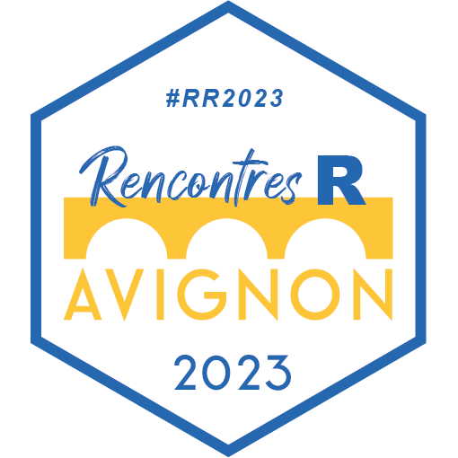

# Rencontres R 2023

## Présentation

Les Rencontres R 2023 se sont tenues du 21 au 23 juin à Avignon, France.

Les Rencontres R, portées par la Société Française de Statistique ([SFdS](https://www.sfds.asso.fr/)), ont pour objectif d'offrir à la communauté francophone un lieu d'échange et de partage d'idées sur l'usage du langage R toutes disciplines confondues.

L'édition 2023 est co-organisée par [INRAE](https://www.inrae.fr/) et [Avignon Université](https://univ-avignon.fr/). Elle s'adresse aussi bien aux débutants qu'aux utilisateurs confirmés et expérimentés issus de tous les secteurs d'activités.

Plus d'information : https://rr2023.sciencesconf.org  

Twitter : [@rencontres_R](https://twitter.com/rencontres_R)  

LinkedIn groupe : [Rencontres R groupe](https://www.linkedin.com/groups/14126026/)  

Les Rencontres R 2023 c'est :  
-> 250 Participants
-> 5 Demi-journées  
-> 5 Keynotes  
-> 3 Tutoriels  
-> 35 Présentations  
-> 20 Lightning  
-> 19 Posters  

## Programmes

[Le programme en PDF](Rencontres_R_2023_Program.pdf) English version  

https://rr2023.sciencesconf.org/program

### Keynotes

https://rr2023.sciencesconf.org/page/conferenciers

* [Tips pour combattre le syndrome de l'imposteur](https://www.google.com/url?q=https://bit.ly/imposteur-avignon&sa=D&source=editors&ust=1687880572930550&usg=AOvVaw2BpH2o17LbvNuv_fLsKuq_) - Aurélie Vache, OVHcloud
* [Data science without the data](https://statsrhian.github.io/talks/2023/2023-06-22-data-science-without-the-data/slides.html#/title-slide) - Rhian Davies, Jumping Rivers
* [R dans l'univers de la Dataviz](https://github.com/holtzy/Talk/blob/master/2023/R_in_Dataviz_universe.pdf) - Yan Holtz, Datadog
* [L'écosystème spatial de R](https://rcarto.github.io/RencontresR_2023/#/title-slide) - Timothée Giraud, UAR RIATE
* [Pastels, paillettes et packages pour accompagner la recherche avec R](Presentations/3_Vendredi/2_Keynote_V/vaudor_keynote_papapapapa_RR2023.pdf) - Lise Vaudor, CNRS

### Tutoriels

https://rr2023.sciencesconf.org/page/tutoriels

* [De R markdown à Quarto sans effort aller plus loin avec ses publications - Christophe Dervieux, Posit](https://cderv.quarto.pub/tuto-quarto-rr2023/)
* [Créer un pipeline de machine learning complet avec {tidymodels}](https://github.com/abichat/rr23-tuto-tidymodels)
* [Analyse spatiale et cartographie avec R](https://github.com/antuki/RR2023_tuto_statspatiale)

### Posters

* [{VMR} to manage Virtual Machines for/with R](Posters/JF_REY_RR2023_VMR.pdf) - jean-françois rey, INRAE, Biostatistique et Processus Spatiaux
* [Packages mggd et mcauchyd – Distribution gaussienne généralisée multivariée, distribution de Cauchy multivariée](Posters/Santagostini_Bouhlel_irhs.pdf) - Pierre Santagostini, IRHS - Équipe ImHorPhen (Imagerie pour l'Horticulture et le Phénotypage)
* [Modelling plant resistance deployment: the R package {landsepi}](Posters/landsepiposter.pdf) - Loup Rimbaud, Pathologie Végétale - Julien Papaïx, BioSP
* Welcome to the golemverse - Colin FAY, ThinkR
* [Une application R Shiny pour la simulation du bilan hydrique des sols viticoles (modèle WaLIS)](Posters/PosterRR2023_DELPUECH.pdf) - Xavier Delpuech, Institut français de la vigne et du vin
*  Enseigner les statistiques avec YouTube et la pop culture - nancy rebout, VetAgro Sup - Institut national d'enseignement supérieur et de recherche en alimentation, santé animale, sciences agronomiques et de l'environnement, Département Territoires et Société
*  R package for analyzing adverse drug reactions in FDA database: Evaluation of ALS patients adverse drug reactions - Luis Garcez, Centro de Estatística e Aplicações da Universidade de Lisboa
* [{qdd} : {qdd} : un package R de contrôle de la qualité et de nettoyage des données pour les Plateformes d'Epidémiosurveillance](Posters/poster_qdd_mmarjou.pdf) - Marine Marjou, Biostatistique et Processus Spatiaux
* [airGRgalaxy : des outils hydrologiques autour des modèles GR](Posters/airGRgalaxy_poster_Rencontres-R-2023.pdf) - Olivier Delaigue, Hydrosystèmes continentaux anthropisés : ressources, risques, restauration
* [SK8 : Un service institutionnel de gestion et d'hébergement d'applications Shiny](https://hal.inrae.fr/hal-04141247) - Elise Maigné & SK8 Team
* [Développement d'une base de données hydro-climatiques nationale à l'aide de R](Posters/BDD-Hydroclim_poster_Rencontres-R-2023.pdf) - Guilherme Mendoza Guimarães, Hydrosystèmes continentaux anthropisés : ressources, risques, restauration
* [IDEATools : Un package R pour évaluer la durabilité des exploitations agricoles avec la méthode IDEA4](Posters/poster_IDEATools.pdf) - David Carayon, INRAE Nlle Aquitaine-Bordeaux / UR ETTIS
*  RFLOMICS: Interactive web application for multi-omics data analysis - Audrey Hulot, Institut Jean-Pierre Bourgin - Delphine CHARIF, Institut Jean-Pierre Bourgin
*  Russ a 10 ans ... - Bénédicte Garnier, Institut national d'études démographiques
*  Analyse de réseaux trophiques : comparaison d'algorithmes pour l'échantillonage uniforme de polytope - Théo Grente, Laboratoire de Mathématiques Nicolas Oresme, France Energies Marines [Brest]
*  L'analyse de survie, une « nouvelle » méthode pour modéliser les dynamiques temporelles du dépérissement de la vigne - Inchboard Lauren, Bordeaux Sciences Agro [Gradignan]
* [Le futur c'est SAS ! Euh. . . non, Sass !](Posters/poster_breant_sass.pdf) - Arthur Bréant, ThinkR

### Lightning

* [DeCovarT, a R package for a robust deconvolution of cell mixture in transcriptomic samples using a multivariate Gaussian generative framework](Presentations/1_Mercredi/3_Lightning_I/1_rencontresR_bastien_chassagnol_short_talk.pdf) - Bastien Chassagnol, Institut de Recherches SERVIER, Laboratoire de Probabilités, Statistique et Modélisation, LIP6  
* [CGI – Permettre à de nouveaux utilisateurs de R de créer des graphiques respectant les contraintes de son institut](Presentations/1_Mercredi/3_Lightning_I/2_Presentation_CGI_DUPIN.pdf) - Jean Dupin, INSEE  
* [Applications Shiny pour le suivi de systèmes agricoles et environementaux](Presentations/1_Mercredi/3_Lightning_I/3_presentation_L_Croce_T_Faure.pdf) - Thierry Faure, Laboratoire d'Ingénierie pour les Systèmes Complexes (LISC)  
* [Camtrapviz, une interface Shiny pour visualiser les données de pièges photographiques](Presentations/1_Mercredi/3_Lightning_I/4_NICVERT_Lisa_camtrapviz.pdf) - Lisa Nicvert, Laboratoire de Biométrie et Biologie Evolutive - UMR 5558	
* [{crosstable} : décrivez vos datasets en quelques lignes](Presentations/1_Mercredi/3_Lightning_I/5_CHALTIEL_Rencontres_R_2023-presentation_crosstable.pdf) - Dan Chaltiel, Direction de la recherche [Gustave Roussy]
* [ShinySbm : une application Shiny pour analyser des réseaux à l'aide de modèles à blocs stochastiques](Presentations/2_Jeudi/2_Lightning_II/1_VANRENTERGHEM_ShinySBM.pdf) - Théodore Vanrenterghem, UMR MIA Paris-Saclay
* ["AHHH #$@% ça marche pas !" : Aidez votre père dans sa lutte avec l'informatique et devenez un.e meilleur.e développeur.se](Presentations/2_Jeudi/2_Lightning_II/2_AHHHH_antoine_languillaume_rr23_lighting.pdf) - Antoine Languillaume, ThinkR  
* [Pybind11/reticulate comme alternative à Rcpp](Presentations/2_Jeudi/2_Lightning_II/3_COLLIN_Pybind11_reticulate_as_an_alternative_to_Rcpp.pdf) - François-David Collin, Institut Montpelliérain Alexander Grothendieck  
* [SABRE (industrial project)](Presentations/2_Jeudi/2_Lightning_II/4_PUDLICKI_SABRE.pdf) - Antony Pudlicki, MERSEN-BIATSS  
* [MyFamilyRisk: une application R/Shiny pour saisir facilement son histoire familiale de cancer.](Presentations/2_Jeudi/2_Lightning_II/5_pres_YOUENN_DROUET.pdf) - Youenn Drouet, Laboratoire de Biométrie et Biologie Evolutive - UMR 5558, Centre Léon Bérard
* [{golem} et {fusen}, le combo gagnant pour construire des applications Shiny robustes et faciles à maintenir](Presentations/2_Jeudi/2_Lightning_II/6_Rochette_RR2023_golem-fusen.pdf) - Sébastien Rochette, ThinkR
* [{matreex} : Simuler les dynamiques forestières européeennes](Presentations/2_Jeudi/2_Lightning_II/7_JAUNATRE_matreex_pres.pdf) - Maxime Jaunatre, Laboratoire des EcoSystèmes et des Sociétés en Montagne
* [R-Ladies Paris, une communauté engagée garantissant la diversité et l'inclusivité](Presentations/2_Jeudi/2_Lightning_II/8_Presentation_de_R_Ladies_Paris_Mouna_Belaid.pdf) - Mouna Belaid, R-Ladies Paris
* [{autoimport} : gérer l'enfer des imports](Presentations/2_Jeudi/5_Lightning_III/1_CHALTIEL_Rencontres_R_2023-presentation_autoimport.pdf) - Dan Chaltiel, Direction de la recherche [Gustave Roussy]	
* [Réaliser ses tableaux avec flextable](Presentations/2_Jeudi/5_Lightning_III/2_pres-flextable_gohel.pdf) - David Gohel, ArData	
* [La modélisation individu-centrée sur R avec le package NetLogoR](Presentations/2_Jeudi/5_Lightning_III/3_Bauduin_NetLogoR.pdf) - Sarah Bauduin, Office Français de la Biodiversité	
* [Combien d'animaux dans mon essai ?](Presentations/2_Jeudi/5_Lightning_III/4_RR2023-Combien_d_animaux_dans_mon_essai_DECHAUX.pdf) - Terence Dechaux, DATASTAT	
* [{happign} : une porte ouverte sur les données IGN](Presentations/2_Jeudi/5_Lightning_III/5_happign_carteron_paul.pdf) - Paul CARTERON, particulier	
* [survivalGPU : Analyses de survie sur cartes graphiques](Presentations/2_Jeudi/5_Lightning_III/6_survivalGPU_presentation_VANSTRAATEN.pdf) - Alexis Van STRAATEN, Assistance Publique-Hôpitaux de Paris (AP-HP), Service d'informatique Médicale, Biostatistiques Et Santé Publique, Hôpital Européen Georges Pompidou, Paris

### Infrastructure

* [Comment bien rater votre forge logicielle R ?](https://connect.thinkr.fr/rr2023/) - Vincent Guyader, ThinkR  
* [RKeOps v2: Kernel operations with Symbolic Tensors on the GPU in R](Presentations/1_Mercredi/4a_Infra_I/2_pres_amelie/beamer_rkeops.pdf) - Amélie Vernay, Institut Montpelliérain Alexander Grothendieck
* [MongoDB](Presentations/1_Mercredi/4a_Infra_I/3_pres_colin/colinfay.pdf) - J'suis pas venu ici pour souffrir, ok ? - Colin FAY, ThinkR
* [7 Méthodes secrètes des informaticiens pour mieux programmer](Presentations/2_Jeudi/3a_Infra_II/1_LEROY_7_methodes_secretes_pour_mieux_programmer_makina-corpus_regilero.pdf) - Régis Leroy, Makina Corpus
* [R sur OpenBSD](Presentations/2_Jeudi/3a_Infra_II/2_BUSKVEKSTER_r-sur-openbsd.pdf) - Andre Buskvekster aka Thomas Levine, Omega Verksted
* [meRoo : Un écosystème logiciel pour l'apprentissage des sciences des données installé sur un cluster de Raspberry Pi](https://regnault.pages.math.cnrs.fr/meroo_pres_rr/20230622_meroo_pres_RR.html#/title-slide) - Philippe REGNAULT, Laboratoire de Mathématiques de Reims

### Shiny/Plumber

* [Comment Shiny aide Enedis à contribuer à la transition énergétique pour les collectivités territoriales](Presentations/1_Mercredi/4b_Shiny_Plumber_I/rencontres_r_2023_capten_github) - Gabrielle Devaux, Lincoln, Enedis
* [glitter makes SPARQL: glitter, un package R pour explorer et collecter des données du web sémantique](Presentations/1_Mercredi/4b_Shiny_Plumber_I/2_vaudor_RR_2023/vaudor_preslongue_glitter_RR2023.html) - Lise Vaudor, Environnement Ville Société
* [Vigie-Analyse, des applications shiny pour les scol'R](Presentations/1_Mercredi/4b_Shiny_Plumber_I/3_benateau_shiny_scolaire.pdf) - Simon Benateau, CESCO
* [Et si {shiny} n'existait pas. . . ?](Presentations/2_Jeudi/7a_Shiny_Plumber_II/1_si_shiny.html) - Cervan Girard, ThinkR
* [Construiriez-vous votre cuisine sans en avoir fait des plans ?](https://arthurdata.github.io/rencontresR2023/#/title-slide) - Arthur Bréant, ThinkR
* [{mariobox}: des APIs {plumber} à toute épreuve](Presentations/2_Jeudi/7a_Shiny_Plumber_II/mariobox-rr23.pdf) - Antoine Languillaume, ThinkR

### Eduction/Enseignement

* [Initier 2400 personnes à R par enchantement : une histoire de licornes, potion et génie...logiciel](Presentations/1_Mercredi/6a_Education_Enseignement_I/1_murielledelmotte_RR2023.html) - Murielle Delmotte, ThinkR	
* Diffuser la culture de la reproductibilité par une formation aux bonnes pratiques: de la qualité d'un projet aux pipelines de données - Lino Galiana, INSEE	
* [Où trouver de l'aide quand on apprend R ?](Presentations/1_Mercredi/6a_Education_Enseignement_I/presentation_rencontres_r_marie_vaugoyeau.pdf) - Marie Vaugoyeau, MStats
* [Rzine : pour la diffusion et le partage de ressources sur la pratique de R en SHS](https://rzine.gitpages.huma-num.fr/communications/rr2023/#/title-slide) - Hugues Pecout, CNRS
* [Application {shiny} de correction de projets individuels utilisant R, RStudio, GitHub](Presentations/2_Jeudi/6b_Education_Enseignement_II/2_RRavignon2023_engels_presentation.pdf) - Guyliann Engels, Service d'écologie numérique, Institut Complexys & Infortech, Université de Mons
* [fRench : R en français](Presentations/2_Jeudi/6b_Education_Enseignement_II/3_fRench.pdf) - Philippe Grosjean, Université de Mons - UMONS (BELGIQUE)

### Reporting

* [Se démarquer avec les thèmes HTML Quarto.](https://cderv.github.io/rr-2023-quarto-html-theming/#/title-slide) - christophe dervieux, Posit
* [Computo: An academic journal promoting reproductibility via Quarto and Continuous Integration](Presentations/1_Mercredi/6b_Reporting/2_COMPUTO_Chiquet.htm) - Julien Chiquet, Mathématiques et Informatique Appliquées
* [Synthèse hebdomadaire de la consommation d'électricité française](Presentations/1_Mercredi/6b_Reporting/3_CADORET_3_RTE_SyntheseHebdo_RR2023.pdf) - Valentin Cadoret, Réseau de Transport d'Electricité [Paris] - Victor PERRIER, dreamRs

### DataViz

* [ggiraph et shiny](https://www.ardata.fr/ggiraph-rr2023/#/title-slide) - David Gohel, ArData	
* [Visualisations interactives de données au service de la prise de décision sur les études cliniques de phase précoce en oncologie](Presentations/2_Jeudi/6a_Dataviz/2_Sanofi_Rencontres_R_20230621_Charlotte_CHEININ.pdf) - Charlotte Cheinin, Sanofi	
* [Utiliser R et Python pour le traitement de données : exploration des avantages de Python en matière de visualisation](Presentations/2_Jeudi/6a_Dataviz/R_et_python_mcarlos.pdf) - Mickaël Carlos, Makina Corpus

### Stats/ML/IA

* [{tabnet} : Un package de deep-learning pour données tabulaires entièrement intégré à tidymodels](Presentations/2_Jeudi/7b_Stat_ML_IA/1_Tabnet_RR2023_fr_pdf.pdf) - Christophe Regouby, Airbus
* [fdacluster: Clustering for Functional Data](Presentations/2_Jeudi/7b_Stat_ML_IA/2_stamm_rr2023_VF.html) - Aymeric Stamm, Laboratoire de Mathématiques Jean Leray
* [Manipuler les moyennes mobiles avec R et JDemetra+](Presentations/2_Jeudi/7b_Stat_ML_IA/3_Slides_rr_AQLT_Quartier-la-tente.pdf) - Alain Quartier-la-Tente, Insee

### Geospatial

* [Qualité de l'air ambiant en Wallonie (Belgique) - Visualisation des mesures de la pollution via une app' R-Shiny {golem} dans un environnement ShinyProxy](Presentations/2_Jeudi/3b_Geospatial_I/1_rr2023_20230622_SPANU_ISSEP.pdf) - Laurent SPANU, Institut Scientifique de Service Public	
* [Suivi de la réponse des agroécosystèmes au changement climatique. Visualisation sur une application R-Shiny](Presentations/2_Jeudi/3b_Geospatial_I/2_Visualisation_de_la_reponse_des_agrosystemes_aux_changements_climatique-Alexis_Fribault.pdf) - Alexis Fribault, Laboratoire d'étude des Interactions Sol - Agrosystème - Hydrosystème	
* [phacochr: un géocodeur pour les géocoder tous - Package R pour réaliser le géocodage d'adresses en Belgique](Presentations/2_Jeudi/3b_Geospatial_I/3_Presentation_PhacochR_Avignon_vcourte.pdf) - Joël Girès, Observatoire de la Santé et du Social de Bruxelles-Capitale - Hugo Périlleux, Université Libre de Bruxelles - Institut de Gestion de l'Environnement et d'Aménagement du Territoire
* [Lissage spatial avec le package btb](Presentations/3_Vendredi/3a_Geospatial_II/1_Beyond_The_Border.pdf) - Kim Antunez, Insee - Julien Pramil, Insee
* [Quelle géostatistique pour des DPE à la localisation incertaine ?](Presentations/3_Vendredi/3a_Geospatial_II/2_rencontresR2023_Marc_Grossouvre_DPE.pdf) - Marc Grossouvre, Institut Henri Fayol, Département GMI, Espace Fauriel, 29 rue Ponchardier, 42023 Saint-Etienne, U.R.B.S. SAS, Laboratoire d'Informatique, de Modélisation et d'Optimisation des Systèmes
* [Modèle hiérarchique de processus gaussien des plus proches voisins non stationnaire, multivarié, et non séparable, pour la modélisation des polluants atmosphériques](Presentations/3_Vendredi/3a_Geospatial_II/3_sebastien_coube.pdf) - Sébastien Coube, Université de Pau et des Pays de lÁdour

### Workflow

* [La reproductibilité avec R, ou pourquoi celle-ci est située sur un continuum](https://649017259ea33242fbd1a328--courageous-cajeta-2542d9.netlify.app/#/title-slide) - Bruno André Rodrigues Coelho, Ministère de l'enseignement supérieur et de la recherche	
* [Faire un package R documenté, testé, versionné et intégré en quelques minutes ? Challenge accepted !](Presentations/3_Vendredi/3b_Workflow/2_faire-un-package_rr2023_florence-mounier/2023-06-23_RR2023_slides_florence.html) - Florence Mounier, ThinkR	
* [{lozen}, le thermomix de vos projets de développement R](ymansiaux.github.io/rencontresR2023) - YOHANN MANSIAUX, ThinkR

## Les comités

### Comité d'organisation

* Jean-François Rey (Président)
* Edith Gabriel (Trèsorière)
* Emily Walker
* Anna Melnykova
* Marine Marjou
* Sylvie Jouslin
* Tania Jimenez
* Claude Bruchou
* Loic Houde
* Amélie Lagalisse

### Comité de programme

*	Diane Beldame (Présidente)
*	Edith Gabriel
*	Maëlle Salmon
*	Stephane Dray
*	Maria Paula Caldas
*	Marion Louveaux
*	Elisabeth Morand
*	Ahmadou Dicko

### Comité de pilotage

* Marie Chavent
* Stéphane Dray
* Rémy Drouilhet
* Robin Genuer
* Francois Husson
* Julie Josse
* Benoit Liquet

## Remerciements

Nous remercions les différents comités et nos [sponsors](https://rr2023.sciencesconf.org/page/partenaires).
